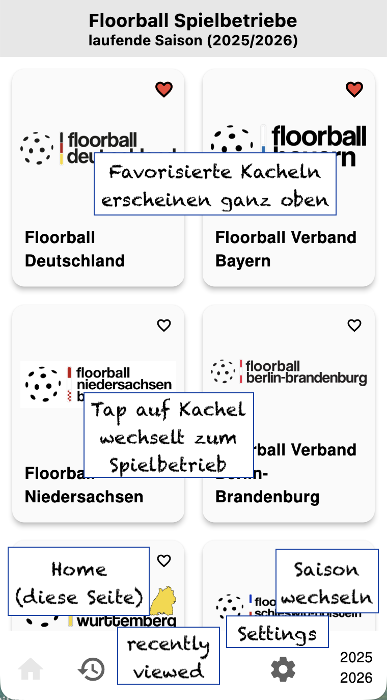

# Kurzanleitung zur App

Diese Seite enthält Screenshots der App, die mit kleinen "Post-it"s
versehen sind, um auf Features hinzuweisen. Manches davon ist ziemlich
offensichtlich, anderes vielleicht nicht ganz so.
Zusätzlich gibt es zu jedem Screenshot ein wenig Fließtext, um auf
wissenswerte "Interna" hinzuweisen.

## Generelles

  * Das ist *keine offizielle app* von Floorball Deutschland, es ist
    mein Hobby-Projekt
  * Die Daten, die diese App anzeigt stammen aus dem
    [Saisonmanager](http://saisonmanager.de); sie sind also so aktuell,
    korrekt und vollständig, wie sie dort eingetragen wurden.
  * Falls jemand Bugs findet oder Ideen hat oder selbst Verbesserungen
    einbringen will, so sei auf https://github.com/aytchell/floorball_manager
    verwiesen -- aber wie gesagt ... das hier ist Freizeit

## Startseite

Direkt nach dem Öffnen der App landet man auf der Startseite. Hier werden
die Spielbetriebe angezeigt:

... to be continued